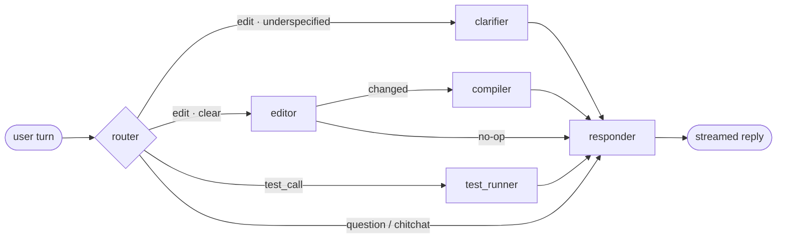

<div align="center">

# 🎙️ Voice Agent Builder

**Chat with an AI builder → it creates and edits a voice AI sales agent → the agent calls leads, qualifies them, and books meetings.**

<sub>Next.js 16 · TypeScript · LangGraph.js · Claude · Vapi · Cal.com · Supabase · LangSmith</sub>

<sub>Alta AI — AI Engineer home assignment</sub>

</div>

---

## 📹 Demo

> **Video walkthrough:** _<add link>_

Three surfaces, one shared artifact:

| Surface | Route | What it does |
| --- | --- | --- |
| **Builder** | `/` | Natural-language chat that creates & edits the agent. Streams replies, shows a live spec panel, a diff of what changed, and the compiled prompt. |
| **Dashboard** | `/dashboard` | A CRM-style lead list + confirm-gated "Call" button, call history with transcript, recording, cost, and both scoring tracks. |
| **Evals** | `/evals` | Runs a 10-persona simulated-call harness against the agent and reports pass/fail per case with a full transcript drawer. |

---

## 🧩 The one idea: spec-as-contract

The builder agent and the voice agent **never talk to each other**. They are joined by one canonical artifact — the **`AgentSpec`** ([`src/lib/spec/schema.ts`](src/lib/spec/schema.ts)).

```
User NL ──▶ BUILDER GRAPH (LangGraph.js · LLM + pure tools) ──▶ AgentSpec  (canonical, in Postgres)
                                                                    │
                                                                    ▼  compile() + Zod validate — deterministic, NO LLM
                                                              Vapi Assistant (live voice config)
                                                                    │  Vapi calls our webhooks at call time
                                                                    ▼
                              RUNTIME TOOLS: qualify_lead · check_availability · book_meeting · schedule_callback
                                                                    │  end-of-call webhook (transcript · recording · cost)
                                                                    ▼
                                       Scoring + Evals ──▶ insights back into the builder chat
```

Why this shape:

- **One vocabulary.** The compiler, the runtime tools, the fit scorer, the builder's tools and the eval harness all speak `AgentSpec` — nothing else.
- **One airlock.** `AgentSpecSchema.parse()` runs before anything reaches Vapi, so a hallucinated field can never reach a live phone call.
- **One Vapi-aware module.** Every Vapi type name lives in [`src/lib/compiler/`](src/lib/compiler/). Swapping to Retell or Bland touches that directory and nothing else.

---

## 🕸️ The builder graph

[`src/lib/builder/graph.ts`](src/lib/builder/graph.ts) — six LangGraph.js nodes. One invocation per user turn.



| Node | Job | LLM? |
| --- | --- | --- |
| **router** | Classifies the turn — `edit` · `question` · `test_call` · `chitchat` — **and** decides `needsClarification` in the same structured-output call. | ✅ structured |
| **clarifier** | Only formulates the *one* targeted question. It never re-decides *whether* to ask — the router is the single source of truth. | ✅ structured |
| **editor** | A pure tool-calling loop over `configure_identity` / `configure_qualification` / `set_goal` / `set_guardrails`. Each call mutates the in-memory spec via `applyToSpec` (a dumb switch, **no LLM**). | ✅ tools |
| **compiler** | Deterministic: validate → build the Vapi object → `POST`/`PATCH` → persist. | ❌ |
| **test_runner** | Stages a test call. It deliberately does *not* dial — confirmation lives in the UI. | ❌ |
| **responder** | The single place every user-facing reply is produced and token-streamed. | ✅ streaming |

**Four decisions worth calling out:**

1. **Edit is first-class, not create-then-overwrite.** The editor is handed the *current spec directly in its system prompt* (it's already in state — no read round-trip). So `"make her friendlier"` diffs against real state instead of blind-overwriting the qualification criteria the user set five turns ago. The tier-1 eval below asserts exactly this.
2. **Compile once per turn, never per tool call.** The compiler is a graph edge downstream of the editor loop, so a turn that touches four fields still produces **exactly one** Vapi `PATCH` — and zero when nothing changed.
3. **Session memory without a checkpointer.** The client sends the full chat history; every node threads it through `historyToMessages()`. The clarifier therefore remembers the question it asked, and an answer to it routes as `edit`, not as a fresh under-specified request.
4. **Three facts are never invented.** The agent's *name*, its *qualification criteria*, and the *business it represents* have no acceptable default. The router flags any that are missing and the clarifier asks — the editor is explicitly forbidden from filling them in. It also catches ambiguous thresholds (`"budget over $100"` → per month? per year?).

**Streaming.** `/api/builder` runs `builderGraph.stream(..., { streamMode: ["custom","values"] })` and emits SSE: `token` events for reply text, `status` events for the live progress checklist ("Configuring qualification…", "Voice agent synced"), and a final `done` event carrying the diff, compiled prompt, and spec.

---

## 📞 Vapi: the compiler and the call loop

[`src/lib/compiler/`](src/lib/compiler/) is the only Vapi-aware code in the repo.

```
renderPrompt.ts  spec → the system prompt, with a {{leadContext}} placeholder
vapiMap.ts       pure spec → Vapi Assistant object (byte-identical; unit-tested)
vapiClient.ts    thin REST seam (interface + RealVapiClient) — mockable in tests
compile.ts       validate → build → POST (first time) / PATCH (every edit)
```

**Compile-once / lead-per-call.** `renderPrompt(spec)` is deliberately **lead-agnostic**. One Vapi assistant exists per agent and is PATCHed in place forever. The lead is injected **per call** through `assistantOverrides.variableValues` ([`initiateCall.ts`](src/lib/call/initiateCall.ts)) — baking lead data into the prompt would force a recompile + PATCH for every single dial.

**Prompt context layering** — a deliberate mitigation for *lost-in-the-middle*:

```
TOP     identity · critical guardrails · qualification & booking rules
MIDDLE  {{leadContext}}  ← structured CRM fields + unstructured notes, per call
END     the immediate goal, then the critical guardrails REPEATED
```

**The Vapi round trip**

- `POST /api/vapi/tools` — Vapi sends `message.toolCallList[]`; we execute each tool **on our server** and answer `{ results: [{ toolCallId, result }] }`. Correlation to our call row comes from `call.metadata` set at dial time.
- `POST /api/vapi/events` — the end-of-call report. **Invariant: persist first, score second.** The transcript/recording/cost/duration row is saved *before* the intent LLM runs; intent runs in a try/catch and writes `null` on failure. A flaky LLM call must never cost us a call record.
- Local dev runs `next dev` and a **pinned ngrok domain** side by side (`npm run dev`), so the webhook URLs configured in Vapi never go stale.

**Safety rails baked in:** every seeded lead's phone is forced to `DEMO_PHONE`, so the system physically cannot dial a real prospect. `POST /api/calls` returns **428** unless the body carries `confirm: true`, and the UI shows the per-minute cost before you can send it.

---

## 📅 Cal.com

[`src/lib/providers/calendar.ts`](src/lib/providers/calendar.ts) — a `CalendarProvider` interface with two implementations:

- **`CalcomCalendar`** (real, Cal.com API v2) — reads open slots and creates bookings against an event type. Active as soon as `CALCOM_API_KEY` + `CALCOM_EVENT_TYPE_ID` are set.
- **`MockCalendar`** — deterministic fallback, used when Cal.com isn't configured and always in text-mode evals.

Two details from actually running it:

- Cal.com returns *every* open half-hour slot. Reading a dozen of those aloud made the agent summarize them into a vague range ("10:30 to 1:30") that the lead couldn't confirm. We now offer **at most one slot per day, max three** — every option is exact and speakable.
- Cal.com **rejects undeliverable attendee emails**, and seed leads use reserved `.example` addresses on purpose. Bookings route to `DEMO_EMAIL` — the same "never touch a real prospect" idea as `DEMO_PHONE`, scoped to just the booking call.
- Errors degrade to "no slots" / "couldn't book that time" rather than throwing, so a flaky API never becomes a raw error the agent has to say out loud. Google Calendar sync is a Cal.com-side setting, not app code.

---

## 🎯 Hybrid scoring — two tracks, never merged

| | **Track 1 — Fit** | **Track 2 — Intent** |
| --- | --- | --- |
| File | [`scoring/fit.ts`](src/lib/scoring/fit.ts) | [`scoring/intent.ts`](src/lib/scoring/intent.ts) |
| When | **Mid-call**, inside `qualify_lead` | **Post-call**, off the critical path |
| How | Deterministic — hard gates, then a weighted score vs `passScore`. **No LLM.** | Claude over the transcript **+ the lead's CRM notes** |
| Output | `qualified` / `score` / per-criterion breakdown / a human reason | `intent_score`, `stage`, `urgency`, `signals[]`, `objections[]` |
| Authority | **Decides the outcome.** Unit-tested, auditable, reproducible. | **Advisory only — never overrides a hard gate.** |

This is the structured/unstructured split the role description describes. Firmographics are a business rule and must be defensible ("failed required gate: sales team of at least 10"), so they get a pure function. Buying intent — urgency, hesitation, buying-stage language — is genuinely semantic, so it gets an LLM. Merging them would make the qualification decision non-reproducible; keeping them apart means an intent score that wobbles 44→48 between runs is harmless, because it decides nothing.

The same rule applies to Vapi's own end-of-call structured extraction: it may only *fill in* fields the in-call tools never set (a call that dropped before `qualify_lead` ran), never overwrite them.

---

## 🧪 Evals — two tiers

Two agents were built, so two things need evaluating. Both keep the LLM judge as small as possible.

### Tier 1 — the **builder** agent ([`src/lib/builder-eval/`](src/lib/builder-eval/)) · `npm run eval:builder`

21 cases with **fully objective ground truth — no judge at all.** Each runs through a side-effect-free graph (router → maybe editor, no compiler ⇒ no Vapi write, no DB write).

- **Router track (15 cases)** — hand-authored gold labels for `route` + `needsClarification`. Includes paired A/B cases on the same fixture (`"budget over 100"` must clarify · `"a sales team of at least 25"` must not) and a session-memory case (answering the clarifier's own question must not re-ask).
- **Edit track (6 cases)** — one NL instruction against a known spec, asserted on the deterministic `diffSpecs`: the intended paths **must** change and the load-bearing rest **must not**. This is how "surgical edits" stops being a claim and becomes a test.

### Tier 2 — the **voice** agent ([`src/lib/evals/`](src/lib/evals/)) · `/evals` or `npm run eval:smoke`

An LLM-as-lead roleplays a persona in text against the agent running on the **same compiled prompt and the same runtime tools, executed for real** through the `ToolSession` seam — no phone call, no Vapi spend.

```
spec ──▶ buildCasePlan()      EXACTLY 10 deterministic slots, pure function, no LLM
             │                 · qualified anchor · unqualified anchor
             │                 · one solo-failure per hard gate (isolates each gate)
             │                 · a numeric boundary case (exactly on the threshold)
             │                 · up to 2 guardrail probes · freeform fillers for tonal variety
             ▼
         fleshOutPersonas()    ONE structured LLM call adds names/companies/briefs
             │                 grounded in THIS agent's product. Locked attributes always win.
             ▼
         persona_set (golden)  persisted per agent, keyed by a hash of the
             │                 qualification-relevant spec surface — regenerated
             │                 ONLY when that surface changes, so runs stay comparable
             ▼
         runEval()             10 simulated calls → scored
```

**Ground truth is deterministic.** Whether a persona *should* qualify is computed by `scoreFit` over the persona's true attributes — the exact function the live agent runs. So the judge LLM is left with only the genuinely semantic question: *did the agent hold its guardrails?* (and it's skipped entirely when there are none).

A case passes on three independent checks: **qualification correct** (agent's verdict == deterministic truth) · **action correct** (qualified ⇒ meeting booked; unqualified ⇒ callback scheduled) · **guardrails held**. The UI reports pass rate, qualification accuracy, book rate, and guardrail violations, with a drawer showing the persona, the fit breakdown, and the full transcript.

### Tier 0 — unit tests · `npm test`

**61 tests / 10 files**, all green. Every deterministic surface is pinned: the compiler is asserted **byte-identical** for a given spec, plus fit scoring, the case plan (`sampleValues` is checked against `meetsCriterion`), the runtime tools, the spec diff, the providers, and the call payload builder.

### Observability

Every LLM call goes through `getAnthropic()`, wrapped with LangSmith's `wrapAnthropic`. Inside a graph invocation each node is its own child run, so **one builder turn is one nested trace** with per-phase timing and token usage. Tier-1 eval cases are wrapped in named `traceable`s. Leaving `LANGSMITH_TRACING` unset is a silent no-op — no code path changes.

---

## 🗄️ Data model

Supabase Postgres, migrations in [`supabase/migrations/`](supabase/migrations/) (run in order).

| Table | Notes |
| --- | --- |
| `leads` | 10 seeded leads with structured firmographics **and** unstructured `notes`. Every phone forced to `DEMO_PHONE`. |
| `agents` | `spec` jsonb (the one live spec, overwritten in place — no version history), `vapi_assistant_id`, `persona_set` + `persona_set_spec_hash`. |
| `calls` | `mode` test\|live, transcript, recording, duration, cost, `structured_outcome` = `{ fit, intent, extracted, meeting_booked, callback_scheduled }`. |
| `eval_runs` / `eval_cases` | Summary per run; persona, transcript, scores, judge notes per case. |

All DB access goes through [`src/lib/db/repositories/`](src/lib/db/repositories/) — no raw queries elsewhere. All env access goes through [`src/lib/env.ts`](src/lib/env.ts) — one typed place that fails loudly on a missing var.

---

## 🚀 Running it

```bash
npm install
cp .env.example .env.local     # then fill it in (see below)
# run supabase/migrations/0001 → 0004 in the Supabase SQL editor, in order
npm run seed                   # 10 leads, all phones → DEMO_PHONE
npm run dev                    # http://localhost:3000 + pinned ngrok tunnel
```

<details>
<summary><b>Environment variables</b></summary>

| Var | Purpose |
| --- | --- |
| `ANTHROPIC_API_KEY` | Builder graph, eval judge, intent scoring |
| `BUILDER_MODEL` / `RESPONDER_MODEL` | Reasoning nodes (default `claude-sonnet-5`) / the cheap phrasing layer |
| `INCALL_MODEL` | Passed to **Vapi's** Anthropic provider — must be the **dated** snapshot (`claude-haiku-4-5-20251001`); Vapi 400s on a bare alias |
| `VAPI_API_KEY`, `VAPI_PHONE_NUMBER_ID`, `NEXT_PUBLIC_VAPI_PUBLIC_KEY` | Telephony + browser test calls |
| `NEXT_PUBLIC_SUPABASE_URL`, `NEXT_PUBLIC_SUPABASE_ANON_KEY`, `SUPABASE_SERVICE_ROLE_KEY` | Postgres |
| `CALCOM_API_KEY`, `CALCOM_EVENT_TYPE_ID` | Optional — mock calendar is used when unset |
| `NEXT_PUBLIC_BASE_URL` | Public URL for Vapi webhooks (the tunnel domain is parsed from it) |
| `DEMO_PHONE`, `DEMO_EMAIL` | Every lead dials here; every booking is sent here |
| `LANGSMITH_*` | Optional tracing |

</details>

| Command | |
| --- | --- |
| `npm run dev` | App + ngrok tunnel |
| `npm test` | 61 unit tests |
| `npm run build` | Production build |
| `npm run seed` | Seed the 10 leads |
| `npm run eval:builder` | Tier-1 builder evals (21 cases) |
| `npm run eval:smoke` | Tier-2 harness sanity check |
| `npm run builder:smoke` | Create + surgically edit an agent, end to end |
| `npm run memory:smoke` | Clarifier asks → user answers → proceeds without re-asking |

---

## 🧠 Design decisions & trade-offs

**What I optimized for**

- **A seam at every external boundary.** `VapiClient`, `CRMProvider`, `CalendarProvider`, `ToolSession` — each is an interface with a real and a mock implementation. That's what lets the eval harness run the *real* tool logic without a phone call, and what makes "HubSpot is a provider swap" a one-file claim rather than a slide.
- **Determinism wherever a decision has to be defensible.** The compiler, the fit scorer, the case plan, and the spec diff are all pure functions with unit tests. LLMs are used for language and classification; business rules are code.
- **Failure containment.** Persist before scoring. Intent failure → `null`, not a lost call. Cal.com failure → a graceful spoken fallback. Persona generation failure → bare-bones fallback prose, never a blocked eval run.

**Deliberate scope cuts** — spec **versioning** (one live spec, overwritten in place; a diff is shown per turn instead), **batch calling** (a loop over the existing `initiateCall` — the interesting part is already built), and **auth/multi-tenancy** (single-user demo).

**Where I'd go next:** compare eval runs across spec revisions to show whether an edit actually improved the agent, feed guardrail-violation cases from tier-2 straight back into the builder chat as suggested fixes, and add a Salesforce/HubSpot `CRMProvider` alongside the Supabase one.

---

<div align="center">
<sub>Built for Alta AI · <a href="https://github.com/Tghez/Voice-Agent-Builder">github.com/Tghez/Voice-Agent-Builder</a></sub>
</div>
